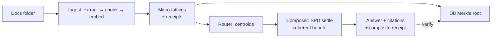

# Oscillink LatticeDB — Self‑Building, Local‑First RAG Database

A single container that ingests your files, builds a verifiable lattice database, and serves coherent answers — entirely offline.
Deterministic receipts, Merkle‑root verification, and a lattice‑of‑lattices router/composer for low‑latency, high‑trust retrieval.

<div align="left"> <!-- keep badges tight: credibility over clutter -->


[](https://github.com/Maverick0351a/oscillinklattticedb/actions/workflows/ci.yml)
[](https://codecov.io/gh/Maverick0351a/oscillinklattticedb)
[](https://github.com/Maverick0351a/oscillinklattticedb/releases)
[](/LICENSE-LATTICEDB)
[](#-documentation)

</div>

## Why this exists (the problem)

Most “RAG” stacks are:

- Hard to deploy (separate vector DBs, indexers, and glue),
- Not verifiable (no receipts, no audit trail),
- Not truly local‑first (egress or hosted dependencies),
- and noisy (hallucinations with weak provenance).

If you care about security, determinism, and time‑to‑value — especially in air‑gapped or regulated environments — you need a single, offline unit that can organize, retrieve, and prove its answers.

## What this project does (the solution)

Oscillink LatticeDB is a self‑building database for retrieval‑augmented generation:

- Drop documents into a folder; the system ingests (text/PDF/OCR*, Office, CSV/XLSX, HTML, EML/MBOX), chunks, embeds, indexes — all locally.
- Content is organized into micro‑lattices (append‑only). A router picks candidate lattices; a composer runs a fast SPD settle to produce a coherent bundle.
- Every step emits deterministic receipts (hashes, ΔH, CG stats) and a DB Merkle root. You can verify any answer against the database state.
- Offline by default. LLM is optional; extractive answers work out of the box.
- Scales gracefully: small corpora use JSONL; large shards auto‑promote to FAISS with the same deterministic behavior.

*OCR quality is governed by thresholds; low‑confidence scans are down‑ranked or abstained with an explicit reason.*

## Key features

- Self‑building, local‑first: one container/VM, no external DB required.
- Deterministic & auditable: signed receipts + DB Merkle root.
- Lattice‑of‑lattices: centroid routing + coherent composition.
- Coherence metrics: exact energy drop (ΔH), CG residuals/iters.
- Guards: OCR quality flags, abstain on weak evidence.
- Ops‑ready: `/health`, `/readyz`, `/metrics`, optional rate limits/JWT.
- UI: minimal chat & receipts modal with “Verify against DB root”.

## Architecture (at a glance)



Determinism contract: given the same inputs/config, you get bit‑identical indexes, receipts, and composite decisions.

## Quickstart (local, minimal)

These commands are illustrative — adjust paths/scripts to your repo.

### Start the API

```bash
# create venv, install dev deps, run API
python -m venv .venv && source .venv/bin/activate
pip install -e .[dev]
uvicorn app.main:app --host 127.0.0.1 --port 8080
```

### (Optional) Start the UI

```bash
cd ui
npm install
npm run dev
# open the printed localhost URL
```

### Build the database

```bash
# fetch or point to a docs folder; then ingest
python scripts/build_lattices.py --input ./sample_docs --out ./latticedb
```

### Check readiness & DB receipt

```bash
curl 'http://127.0.0.1:8080/readyz?db_path=./latticedb'
curl 'http://127.0.0.1:8080/v1/db/receipt' | jq
```

### Ask a question

```bash
python scripts/query.py --db ./latticedb --q "Summarize the indemnity clause"
# or use the UI: ask, then open "Receipts…" and click "Verify"
```

Tip: The watcher can run in the background so dropping files triggers ingest automatically.

## Benchmarks (what matters and how to run them)

See README in the repo root for detailed benchmark tasks and SLOs.
